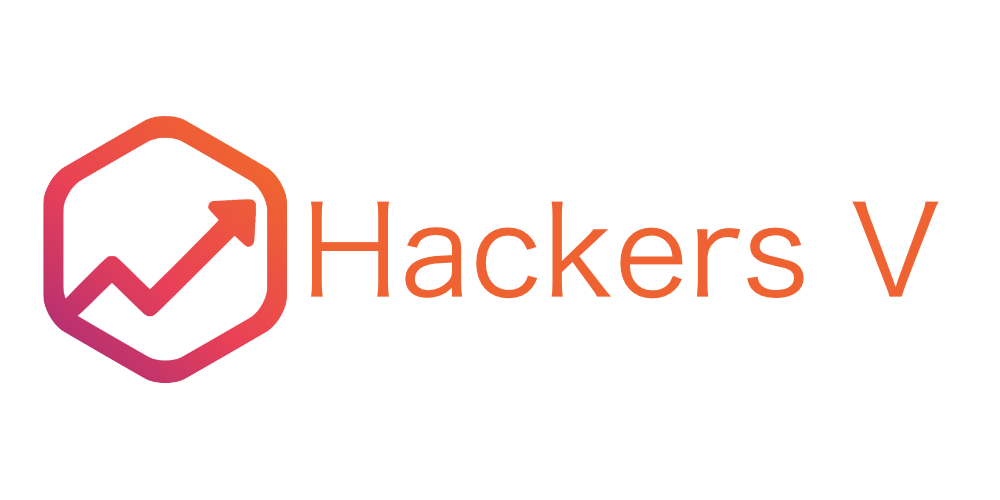
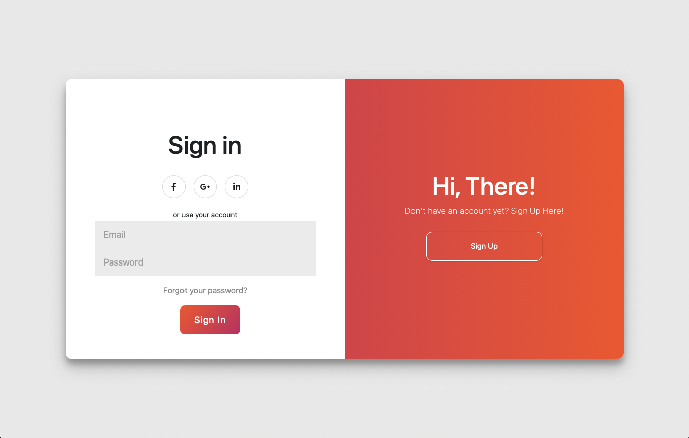
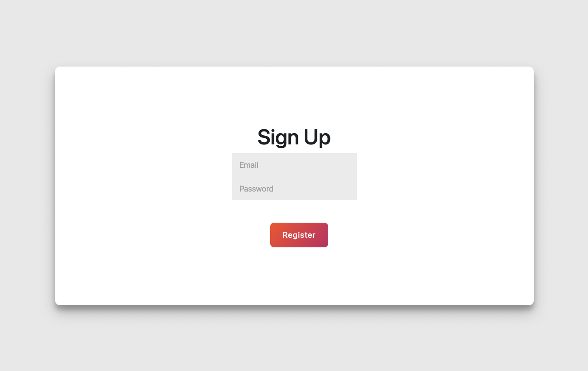
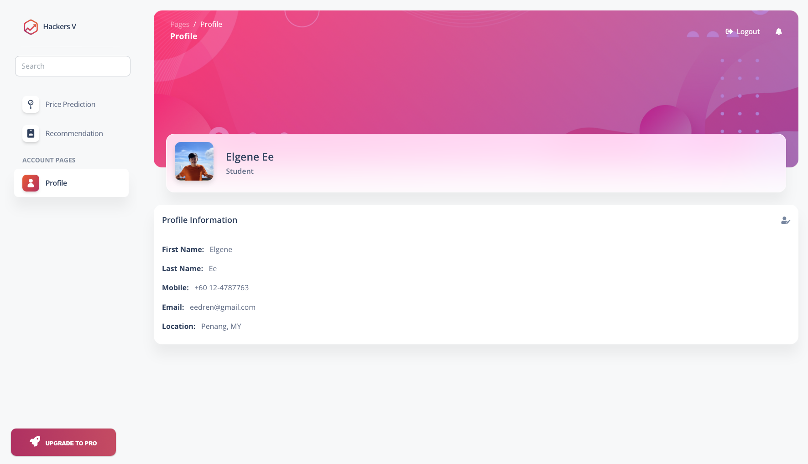
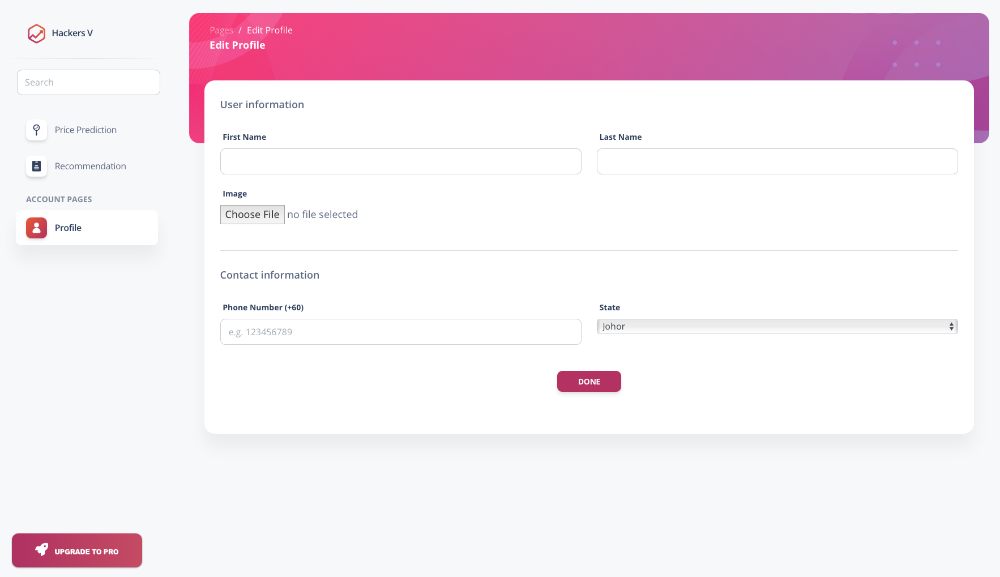
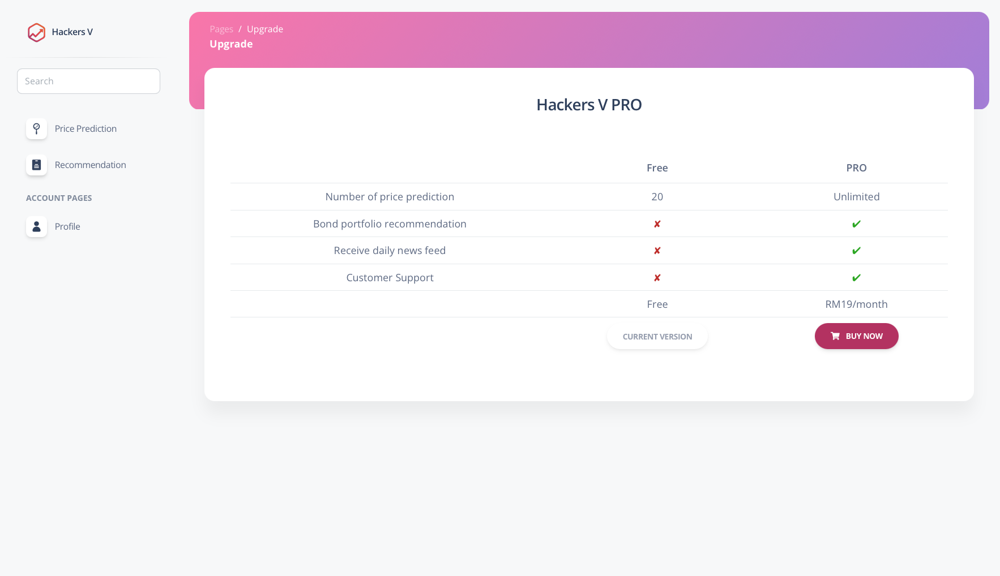

<!-- PROJECT LOGO -->
 

    

<!--TABLE OF CONTENTS-->
## Table Of Contents
  1. [Our Team](#our-team)
  2. [Problem Statement](#problem-statement)
  3. [About The Project](#about-the-project)
  4. [Sample Outputs](#sample-outputs)

<!--OUR TEAM-->
## Our Team
No. | Team Member
--- | --- | 
1 | PANG CHONG WEN
2 | ELGENE EE DING REN
3 | KAYSHAV RENGANATHAN
4 | HO ZHI YI
5 | CHUAH ANN JOE

<!--PROBLEM STATEMENT-->
## Problem Statement
1. Forecast price movements of bonds
2. Select top 5 bonds that will provide highest return/volatility ratio

<!--ABOUT THE PROJECT-->
## About The Project
Our team has came up with a web app helping users to predict the bond price using AutoML from Microsoft Azure. The application also suggests top 5 bonds to users based on return/volatility ratio.

<!--SAMPLE OUTPUTS-->
## Sample Outputs

    

    

    

    

    

